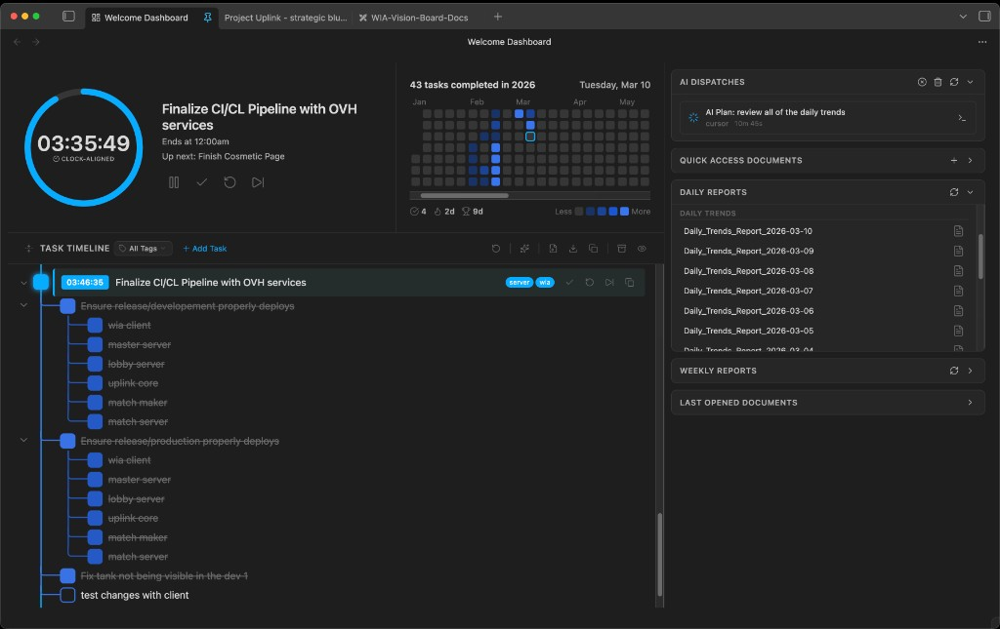

# Vault Welcome Dashboard


**A productivity-first home screen for [Obsidian](https://obsidian.md).** Replaces the default empty tab with an interactive dashboard: clock-aligned rollover timer, chunked task management with git-tree subtasks, and a modular widget system. Theme-aware and responsive out of the box.

## Why This Exists

Most task timers treat time as a raw countdown: start 30 minutes, finish whenever. Real schedules don't work that way. Meetings start on the hour, focus blocks end at :30. **Vault Welcome** snaps every timer to the next clean time boundary so your day stays structured without manual math. Finish early and the leftover minutes bank forward; go over and the debt rolls into the next task. It's a self-correcting schedule that keeps you on track across an entire work session.

Opens as the first thing you see in your vault: tasks, timer, recent documents, and productivity history in one view.

## Screenshots



Adapts to any Obsidian theme (light, dark, or custom).

## Features

### Clock-Aligned Rollover Timer

- Start a task and the timer snaps to the next clean time boundary (configurable: 15/30/60 min intervals)
- Example: start a 30-min task at 6:12, timer ends at 7:00 (not 6:42)
- **Positive rollover (time banking)**: Finish early and the remaining time carries to the next task
- **Negative rollover (time debt)**: Go over and the debt is subtracted from the next task's allotment
- Timer persists across Obsidian restarts

### Pomodoro Mode

- Toggle between clock-aligned and classic Pomodoro (work/break intervals)
- Configurable work, short break, and long break durations
- Session counter dots and auto-cycling between work and break phases

### Chunked Task Management

- Add tasks with title, description, and duration
- Each task is started individually with its own clock-aligned timer
- Drag-and-drop reordering with git-tree visual layout
- Rollover balance flows from one task to the next
- Task state stored locally in `data.json`

### Sub-Task Tree (Git-Tree View)

- Nest subtasks up to 4 levels deep under any parent task
- Visual branch and connector layout with depth-colored lines (customizable branch color)
- Collapsible branches, inline completion toggling, and drag-to-reorder

### Task Tags and Templates

- Freeform color-coded labels for filtering and grouping (e.g. "deep work", "standup")
- **Multi-tag filter**: Select multiple tags to narrow the task list at once (toggle in settings)
- Save and reuse task templates (title, duration, subtasks, tags) for recurring work

### Unified Attachments

- Single "Attachments" section in the task modal combining documents and images
- **Link existing**: Fuzzy-search file picker to attach any vault file
- **Create new**: Type a path (e.g. `Notes/Sprint 4/Design Doc`) to create and link a file in one step. Folders are auto-created.
- **Attach image**: Dedicated image picker filtered to supported formats (png, jpg, gif, svg, webp)
- **Drop zone**: Drag-and-drop or paste files; documents and images are auto-routed by extension
- Attachments display with type-specific icons (`file-text` for docs, `image` for images)
- Linked docs show as a badge with count on the task row; click to open a popover with direct links

### Per-Task Working Directory

- Each task can specify a working directory used as the execution context for AI CLI dispatches
- Browse vault folders via a fuzzy picker, or type an absolute path manually
- Replaces the previous global `aiWorkingDirectory` setting with a per-task model
- Falls back to the vault root when no directory is set

### Task Import from Notes

- Scan any note's checklists and selectively import items as dashboard tasks
- File picker with preview and selective import modal

### Archive and Auto-Archive

- Completed and skipped tasks move to the archive
- **Archive detail modal**: Click any archived task to view full details, then restore or permanently delete
- **Auto-archive**: Automatically archive stale tasks after a configurable number of days (0 = disabled)
- Archive displayed as a card grid with tag pills and timestamps

### Confirmation Dialogs

- Destructive actions (reset all, delete archived, remove task, start over active timer) prompt a confirmation modal
- **Start confirmation**: Starting a task while another is running offers Start Now, Queue Next, or Cancel
- Dialogs can be globally disabled in settings

### AI Integration

- Optional integration with **Cursor CLI** or **Claude Code CLI** for AI-assisted task management
- **AI auto-organize**: Suggest tags and position when creating a task
- **AI auto-order**: Reorder pending tasks by priority from the timeline header
- **AI auto-scheduler**: Suggest durations for tasks without estimates
- **AI delegation**: Dispatch a task (with linked docs and images as context) to a CLI tool for execution
- Writes a temporary prompt file (`_vault-welcome-ai-prompt.md`) and invokes the configured CLI
- All AI features are individually toggleable; set to `none` to disable entirely

### Heatmap Tracker

- GitHub-style contribution grid built from completed tasks and daily note task tags
- Current and longest streak counters
- Weekly/monthly/all-time summary stats (tasks completed, total time, avg session)
- Configurable color schemes (green, red, blue, purple)

### Modular Widget System

The left column is a container of independent widget panels:

| Module                     | Description                                                       |
| -------------------------- | ----------------------------------------------------------------- |
| **Interview Prep**         | Daily interview prep reports                                      |
| **Daily Trends**           | Daily trend reports                                               |
| **Local Leads**            | Daily local lead reports                                          |
| **App Store Intel**        | Daily app store intelligence reports                              |
| **Jobs Report**            | Weekly job market reports                                         |
| **Competitor Watch**       | Weekly competitor analysis reports                                |
| **Last Opened Documents**  | Shows recently opened vault files                                 |
| **Quick Access Documents** | User-pinned file shortcuts (also available via file context menu) |
| **Heatmap Tracker**        | Contribution grid with streak and stat counters                   |
| **AI Dispatches**          | Live AI dispatch status with terminal take-over and plan approval |

Report modules are powered by a configurable `reportBasePath` setting. Each module is collapsible, independently scrollable, and drag-to-reorderable.

### Custom Module API

Other Obsidian plugins can register their own widget panels:

```typescript
const vw = (this.app as any).plugins.plugins["vault-welcome"];
vw.registerModule({
  id: "my-widget",
  name: "My Widget",
  renderContent(el: HTMLElement) {
    el.createDiv({ text: "Hello from my widget!" });
  },
  destroy() {
    /* cleanup */
  },
});

// To remove:
vw.unregisterModule("my-widget");
```

The `ModuleRenderer` interface:

```typescript
interface ModuleRenderer {
  readonly id: string;
  readonly name: string;
  readonly showRefresh?: boolean;
  renderContent(el: HTMLElement): void;
  renderHeaderActions?(actionsEl: HTMLElement): void;
  destroy?(): void;
}
```

### Additional UX

- **Pinned first tab**: auto-pins as the leftmost tab, survives layout changes
- **Audio notifications**: synthesized tones on timer completion and overtime
- **Keyboard shortcuts**: Obsidian commands for start, pause, complete, skip, and add-task
- **Dashboard deep link**: `obsidian://vault-welcome` protocol handler
- **Undo/redo**: snapshot-based undo stack for task mutations
- **Export analytics**: CSV export or append summary to today's daily note
- **Onboarding walkthrough**: inline 4-step guide on first launch
- **Theme-aware**: all colors use Obsidian CSS variables, adapts to any theme
- **Responsive layout**: 2-column desktop grid collapses to single-column on mobile (<800px)

## Technical Highlights

- **Typed Event Bus**: decoupled pub/sub for cross-system communication. Commands, services, and UI sections interact through events, not direct method calls.
- **Interface-Based Registries**: `SectionRenderer` and `ModuleRenderer` interfaces for composable UI. Dashboard layout is data-driven, not hardcoded.
- **Pure-Logic Core Layer**: `core/` has zero Obsidian imports. TimerEngine, TaskManager, UndoManager, and AudioService are testable with plain Node.
- **Generic Undo/Redo**: `UndoManager<T>` provides snapshot-based undo for any state type. TaskManager uses it for task + archive snapshots.
- **Data-Driven Report Sources**: report modules read from user-configurable `ReportSourceConfig[]` in settings. Add, remove, or toggle sources from the settings panel.
- **AI Context Assembly**: AIDispatcher gathers task metadata, linked documents, and images into a structured prompt, then dispatches to Cursor CLI or Claude Code CLI. Each task can specify its own working directory.
- **Shared Vault Utilities**: common operations like `ensureVaultFolder` and `isImageExtension` extracted into reusable modules (`VaultUtils`, `types`) instead of duplicated across files.
- **Encapsulated View State**: no file-scope globals. All mutable UI state (collapsed IDs, filters, archive visibility) lives in typed `ViewState` objects owned by the view.

## Design Philosophy

The architecture applies composition-first principles inspired by Unity's component model: single responsibility per class, composition over inheritance, and decoupled event-driven communication. See [docs/ARCHITECTURE.md](docs/ARCHITECTURE.md) for the full layer diagram, data flow, and design rationale.

## Extending the Plugin

**Custom modules**: Implement `ModuleRenderer` and call `plugin.registerModule()`. See [docs/API.md](docs/API.md) for the full interface, event list, and code examples.

**Custom sections**: Implement `SectionRenderer` with zone/order targeting. See [CONTRIBUTING.md](CONTRIBUTING.md) for step-by-step guides.

## Timer Mechanics

### Clock-Aligned Snapping

```
alignedEnd = ceil((now + effectiveDuration) / snapInterval) * snapInterval
effectiveDuration = baseDuration + rolloverBalance
```

Start at 6:12, 30 min task, snap = 30 min:

- Raw end: 6:42
- Aligned to next :00/:30 boundary: 7:00
- Actual countdown: 48 minutes

### Rollover

- Complete at 6:50 (end was 7:00): `+10 min` banked
- Next task: 30 min base + 10 rollover = 40 min effective, snapped to boundary
- Go past 7:00 by 5 min: `-5 min` debt
- Next task: 30 min base - 5 debt = 25 min effective, snapped to boundary

## Project Structure

```
src/
  main.ts              -- Plugin entry, commands, ribbon, view registration
  WelcomeView.ts       -- Orchestrator composing sections + modules
  MiniTimerView.ts     -- Pop-out mini timer (Spotify-style compact view)
  SettingsTab.ts       -- Plugin settings panel

  core/                -- Zero Obsidian imports. Pure logic. Unit-testable.
    types.ts, EventBus.ts, events.ts, TimerEngine.ts,
    TaskManager.ts, UndoManager.ts, AudioService.ts, ColorUtils.ts,
    TaskFormatter.ts

  interfaces/          -- Contracts only (SectionRenderer, ModuleRenderer)

  sections/            -- SectionRenderer implementations (right column)
    TimerSection.ts, HeatmapBar.ts, TaskTimeline.ts, BoardView.ts,
    SubtaskTree.ts

  modules/             -- ModuleRenderer implementations (left column widgets)
    ModuleCard.ts, ModuleContainer.ts, ModuleRegistry.ts,
    ReportModule.ts, DocumentModule.ts, DispatchModule.ts

  services/            -- Obsidian-coupled vault/file operations
    AIDispatcher.ts, ReportScanner.ts, DocumentTracker.ts,
    AnalyticsExporter.ts, TaskImporter.ts, TaskParser.ts,
    BackupService.ts, VaultUtils.ts

  ui/                  -- Shared DOM components (Tooltip, DropZone, TimerRing, TagPills)
  modals/              -- Obsidian modal dialogs (9 files)
  styles/              -- CSS (14 files, theme-aware)
```

See [docs/ARCHITECTURE.md](docs/ARCHITECTURE.md) for the full layer diagram and dependency graph.

### Data Flow

```
Commands --> EventBus --> TimerSection / TaskManager / AudioService
                              |
TaskManager --> UndoManager --> EventBus("task:changed") --> data.json
                                                              |
WelcomeView <-- EventBus <-- TimerEngine("timer:tick") ------+
     |
     +--> SectionRenderer[] (by zone + order)
     +--> ModuleRegistry --> ModuleContainer --> [modules]
```

## Data Storage

All persistent state lives in `data.json` (managed by Obsidian's plugin data API):

| Key                                  | Contents                                                                                             |
| ------------------------------------ | ---------------------------------------------------------------------------------------------------- |
| `settings.snapIntervalMinutes`       | Clock snap interval (15, 30, or 60)                                                                  |
| `settings.modules[]`                 | Module enable/order/collapse state                                                                   |
| `settings.quickAccessPaths[]`        | Pinned document paths                                                                                |
| `settings.tagColors`                 | Map of tag name to hex color                                                                         |
| `settings.templates[]`               | Saved task templates (name, duration, subtasks, tags)                                                |
| `settings.audioEnabled`              | Master toggle for audio notifications                                                                |
| `settings.timerMode`                 | `'clock-aligned'` or `'pomodoro'`                                                                    |
| `settings.pomodoroWorkMinutes`       | Pomodoro work interval (default 25)                                                                  |
| `settings.pomodoroBreakMinutes`      | Pomodoro short break (default 5)                                                                     |
| `settings.pomodoroLongBreakMinutes`  | Pomodoro long break (default 15)                                                                     |
| `settings.pomodoroLongBreakInterval` | Sessions before long break (default 4)                                                               |
| `settings.hasSeenOnboarding`         | Whether the user dismissed the first-run walkthrough                                                 |
| `settings.moduleOrder[]`             | Persisted module panel ordering                                                                      |
| `settings.aiTool`                    | AI CLI tool: `'cursor'`, `'claude-code'`, or `'none'`                                                |
| `settings.aiToolPath`                | Custom CLI path override                                                                             |
| `settings.aiAutoOrganize`            | AI tag/position suggestions in task modal                                                            |
| `settings.aiAutoOrder`               | AI task reordering in timeline                                                                       |
| `settings.aiDelegation`              | AI task delegation                                                                                   |
| `settings.aiSkipPermissions`         | Skip AI permission prompts                                                                           |
| `settings.terminalApp`               | Terminal app for AI dispatch take-over (`'ghostty'` or `'terminal'`)                                 |
| `settings.enableMultiTagFilter`      | Multi-select tag filtering                                                                           |
| `settings.enableImageAttachments`    | Image attachment support                                                                             |
| `settings.showConfirmDialogs`        | Confirmation dialogs for destructive actions                                                         |
| `settings.autoArchiveDays`           | Auto-archive stale tasks after N days (0 = off)                                                      |
| `settings.reportBasePath`            | Base vault folder for report sources                                                                 |
| `settings.branchColor`               | Custom git-tree branch color                                                                         |
| `settings.taskCategories[]`          | Board view category definitions (id, name, order, color)                                             |
| `settings.activeCategoryId`          | Currently focused category in board view                                                             |
| `settings.modulesCollapsed`          | Whether the modules column is collapsed                                                              |
| `tasks[]`                            | Task list with status, duration, timestamps, tags, sub-tasks, linked docs, images, working directory |
| `archivedTasks[]`                    | Archived completed/skipped tasks                                                                     |
| `timerState`                         | Current timer: running, paused, end time, rollover balance, pomodoro count                           |
| `dispatchHistory[]`                  | AI dispatch records (action, status, timing, output, plan text)                                      |

## Requirements

- **Obsidian** 1.0.0 or later
- **Node.js** 18+ (for building from source)
- **Optional**: Templater plugin (for calendar day-note creation from template)

## Installation

### From Source

```bash
git clone https://github.com/dudetru25/vault-welcome.git
cd vault-welcome
npm install
npm run build
```

Then symlink or copy the built plugin into your vault:

```bash
ln -s /path/to/vault-welcome "/path/to/vault/.obsidian/plugins/vault-welcome"
```

Enable **Vault Welcome Dashboard** in Obsidian > Settings > Community Plugins.

### Development

```bash
npm run dev    # Watch mode -- rebuilds on save
```

Reload Obsidian with `Cmd+R` (macOS) or `Ctrl+R` (Windows/Linux) after changes.

## Roadmap

### Shipped

- Clock-aligned rollover timer with time banking and debt
- Pomodoro mode with configurable intervals
- Chunked task management with drag-and-drop reorder
- Sub-task tree with git-style branch visualization (4 levels, customizable branch color)
- Task tags, categories, and color-coded labels
- Multi-tag filter for narrowing the task list
- Task templates for recurring work
- Unified attachments (documents + images in one section, shared drop zone, type-routed)
- Per-task working directory for AI CLI execution context
- Task import from note checklists (with clipboard paste support via TaskParser)
- Archive detail modal with restore and permanent delete
- Auto-archive stale tasks after configurable days
- Confirmation dialogs for destructive actions (with start-while-active prompt)
- AI integration (Cursor CLI / Claude Code CLI): auto-organize, auto-order, delegation with plan approval
- AI dispatch module with live status, terminal take-over, and plan preview
- Board view (Kanban columns grouped by task category)
- Heatmap tracker with streak and summary stats
- Modular widget system with drag-to-reorder
- Configurable report modules (daily + weekly, user-defined sources)
- Last opened and quick access document modules
- Mini timer pop-out view (Spotify-style compact player)
- Audio notifications (completion chime, overtime warning)
- Keyboard shortcuts for all timer actions
- CSV and daily note analytics export
- Undo/redo for task mutations
- Vault-side backup for data protection across plugin updates
- Dashboard deep link (`obsidian://vault-welcome`)
- Welcome modal for first-run feature overview
- Theme-aware design with Obsidian CSS variables
- Responsive layout (desktop 2-column, mobile single-column)
- Pinned first tab with layout persistence
- Custom module API for third-party plugins

### Planned

- **Day Timeline**: Google Calendar-style time-block view (shelved while the interaction model is refined)

## License

MIT. See [LICENSE](LICENSE).

## Author

**Miguel A. Lopez** | [Rank Up Games LLC](https://github.com/dudetru25)
