# Architecture

## System Overview

Vault Dashboard is an Obsidian plugin that replaces the default empty tab with a productivity dashboard. The architecture is organized around three core principles: **single responsibility** (each class owns one idea), **composition over inheritance** (small, stackable systems), and **decoupled communication** (event bus over hard references).

## Layer Diagram

```mermaid
graph TD
  subgraph core ["core/ -- Zero Obsidian deps, unit-testable"]
    EventBus
    TimerEngine
    TaskManager
    UndoManager["UndoManager&lt;T&gt;"]
    AudioService
    ColorUtils
    TaskFormatter
    GhostTask["ghost-task"]
    ModalTracker["modal-tracker"]
    TimerControls["timer-controls"]
  end

  subgraph ifaces ["interfaces/ -- Contracts only"]
    SectionRenderer
    ModuleRenderer
  end

  subgraph sections ["sections/ -- Right-col UI"]
    TimerSection
    HeatmapBar
    TaskTimeline
    BoardView
    SubtaskTree
  end

  subgraph modules ["modules/ -- Left-col widgets"]
    ModuleRegistry
    ModuleContainer
    ModuleCard
    DailyReportModule
    WeeklyReportModule
    QuickAccessModule
    LastOpenedModule
    DispatchModule
  end

  subgraph svc ["services/ -- Obsidian-coupled"]
    AIDispatcher
    ReportScanner
    DocumentTracker
    AnalyticsExporter
    TaskImporter
    TaskParser
    BackupService
    VaultUtils
    PopoutPositionTracker
  end

  subgraph ui ["ui/ -- Shared DOM components"]
    Tooltip
    DropZone
    TimerRing
    TagPills
    SetupDragHold["setupDragHold"]
  end

  subgraph orch ["Orchestration -- src/ root"]
    main.ts
    WelcomeView
    MiniTimerView
    SettingsTab
  end

  main.ts --> EventBus
  main.ts --> TimerEngine
  main.ts --> TaskManager
  main.ts --> ModuleRegistry
  main.ts --> BackupService
  main.ts --> PopoutPositionTracker

  TimerEngine --> EventBus
  TaskManager --> EventBus
  TaskManager --> UndoManager
  AudioService --> EventBus
  TimerControls --> TimerEngine

  WelcomeView --> EventBus
  WelcomeView --> SectionRenderer
  WelcomeView --> ModuleRegistry
  MiniTimerView --> EventBus
  MiniTimerView --> TimerRing
  MiniTimerView --> GhostTask
  MiniTimerView --> TimerControls

  TimerSection --> EventBus
  TimerSection --> TimerRing
  TimerSection --> GhostTask
  TimerSection --> TimerControls
  HeatmapBar --> EventBus
  TaskTimeline --> EventBus
  TaskTimeline --> SubtaskTree
  TaskTimeline --> SetupDragHold
  BoardView --> TaskFormatter
  BoardView --> SetupDragHold

  ModuleRegistry --> ModuleRenderer
  DispatchModule --> AIDispatcher

  TaskImporter --> TaskParser
```



## Data Flow

Timer state, task mutations, and UI updates propagate through the EventBus. Timer ticks and state changes are separate event channels to keep the 4 Hz tick path lightweight.

### Timer tick path (display-only, 4 Hz)

```
TimerEngine.beginInterval()  [every 250ms while running]
    |
    v
onTick callback --> WelcomeView.updateTimerDisplay()  (text + ring only)
    |
    v
EventBus.emit("timer:tick", { remaining, isNegative })
    |
    +---> MiniTimerView.updateDisplay()
    +---> main.ts: negative detection --> audioService.playWarning()
```

No state copies, no save scheduling, no control rebuilds on this path.

### State change path (start/stop/pause/resume only)

```
TimerEngine.start() / .pause() / .resume() / .stop() / ...
    |
    v
EventBus.emit("timer:state-change", { state })
    |
    +---> main.ts: scheduleSave()  (debounced 1s)
    +---> WelcomeView.onTimerStateChange()  --> renderAll() if state key changed
    +---> MiniTimerView: syncVisibility() + rebuildControls()
```

### Task start via command

```
Command (main.ts)
    |
    v
EventBus.emit("task:start", { task })
    |
    +---> TimerSection.handleStartTask()  --> TimerEngine.start()
    +---> (future listeners can react without coupling)
```

### Task mutations

```
TaskManager.addTask() / .updateTask() / .completeTask() / ...
    |
    v
UndoManager.push(snapshot)
    |
    v
EventBus.emit("task:changed")
    |
    +---> main.ts: persist to data.json
    +---> main.ts: persist vault backup (BackupService)
    +---> WelcomeView: re-render
```

## Design Decisions

### Event Bus over Direct Callbacks

Commands emit events on the bus. TimerSection subscribes to `task:start` and `task:skip`. No command needs a reference to any view or section. Adding a new listener (logging, analytics, notifications) requires zero changes to existing code.

### Tick / State-Change Separation

Timer ticks fire 4 times per second for display updates. State-change events only fire when the timer actually transitions (start, stop, pause, resume, complete). This avoids per-tick object copies, redundant bus emissions, and save scheduling on the hot path. The MiniTimerView's self-poll provides an independent fallback for popout windows where the main window's timer may be throttled by the OS.

### Generic Undo

`UndoManager<T>` accepts any snapshot type. TaskManager uses `UndoManager<{ tasks, archivedTasks }>`. Future systems can use their own typed undo stacks without duplicating the core logic.

### SectionRenderer / ModuleRenderer Split

The dashboard has two distinct composition systems:
- **Sections** (right column): timer, heatmap, task timeline, board view. Rendered by zone + order. Implement `SectionRenderer`.
- **Modules** (left column): report widgets, document panels, quick access, AI dispatches. Rendered in a card grid with drag-reorder. Implement `ModuleRenderer`.

Splitting the interfaces prevents coupling between the two systems and makes each independently extensible.

### Core Has Zero Platform Dependencies

Everything in `core/` imports only from `core/` or standard browser APIs. No Obsidian imports. Core logic is testable with plain Node, reusable in a different host, and immune to platform API changes.

### Ghost Tasks

`ghost-task.ts` provides a synthetic task ID convention for quick-start timers that don't create a persistent task entry. The GhostTaskModal prompts for a name and duration, then starts the timer with a ghost ID. Timer callbacks skip task-manager operations for ghost IDs.

### Timer Controls Composable

`timer-controls.ts` derives the set of visible control buttons (pause, resume, complete, skip, skip-break) from TimerEngine state. Both TimerSection and MiniTimerView consume the same logic, eliminating duplicated conditionals.

### Hold-to-Drag with Teardown

`setupDragHold` wires a hold-threshold interaction before enabling native drag. Returns a teardown function that removes all listeners, preventing accumulation across re-renders.

### BackupService

Writes a full JSON backup of plugin data to a vault file. Survives plugin reinstalls and updates. Restored automatically when `data.json` is empty.

### Data-Driven Report Sources

Report sources live in `PluginSettings.reportSources` as `ReportSourceConfig[]` with user-configurable folder, pattern, frequency, and enabled/disabled state.

### Board View

Kanban-style column layout grouping tasks by `TaskCategory`. Tasks can be viewed in either list mode (TaskTimeline) or board mode (BoardView); WelcomeView toggles between them.

## Extension Points

### Custom Sections

Implement `SectionRenderer` and register in `buildSections()`:

```typescript
interface SectionRenderer {
  readonly id: string;
  readonly zone: 'top-bar' | 'right-col' | 'left-col';
  readonly order: number;
  render(parent: HTMLElement): void;
  update?(): void;
  destroy?(): void;
}
```

### Custom Modules

Implement `ModuleRenderer` and call `plugin.registerModule(renderer)`:

```typescript
interface ModuleRenderer {
  readonly id: string;
  readonly name: string;
  readonly showRefresh?: boolean;
  renderContent(el: HTMLElement): void;
  renderHeaderActions?(actionsEl: HTMLElement): void;
  destroy?(): void;
}
```

### Event Bus Subscriptions

External plugins can subscribe to events for cross-plugin integration:

```typescript
const bus = plugin.eventBus;
bus.on('task:complete', (payload) => { /* react */ });
bus.on('timer:tick', (payload) => { /* react */ });
```

## AI Integration Architecture

`AIDispatcher` assembles context from the task (title, description, subtasks, linked documents, images) into a markdown prompt file. It invokes the configured CLI tool (Cursor or Claude Code) with the prompt path. Plan-phase dispatches produce a plan for review before execution. Dispatch records are stored in `PluginData.dispatchHistory` and hydrated on load. The `DispatchModule` renders live status with terminal take-over, plan preview, IDE launcher, and retry. All AI features are independently toggleable.

## Core vs Obsidian Boundary

| Layer | Obsidian Imports | Testable Without Mocks |
|-------|-----------------|----------------------|
| `core/` | None | Yes |
| `interfaces/` | None | Yes |
| `sections/` | `App`, `setIcon` | Needs Obsidian stubs |
| `modules/` | `App`, `setIcon`, `Notice` | Needs Obsidian stubs |
| `services/` | `App`, `TFile`, `TFolder`, `Notice` | Needs Obsidian stubs |
| `modals/` | `Modal`, `App`, `Notice`, `Platform` | Needs Obsidian stubs |
| `ui/` | `setIcon` (minimal) | Mostly yes |
| Root | `Plugin`, `ItemView`, `WorkspaceLeaf` | Needs Obsidian stubs |

## File Index

| File | Layer | Purpose |
|------|-------|---------|
| `main.ts` | Orchestration | Plugin entry, commands, ribbon, view registration, data persistence |
| `WelcomeView.ts` | Orchestration | Orchestrator composing sections + modules into the dashboard |
| `MiniTimerView.ts` | Orchestration | Pop-out timer view with ring, controls, and independent tick loop |
| `SettingsTab.ts` | Orchestration | Plugin settings panel |
| `core/EventBus.ts` | Core | Typed pub/sub for decoupled communication |
| `core/events.ts` | Core | Event name constants and typed payload interfaces |
| `core/TimerEngine.ts` | Core | Clock-aligned timer with snap, rollover, pomodoro, and tick/state-change separation |
| `core/TaskManager.ts` | Core | Task CRUD, subtask management, ordering, categories, state transitions |
| `core/UndoManager.ts` | Core | Generic snapshot-based undo/redo stack |
| `core/AudioService.ts` | Core | Web Audio tone generator for timer sounds |
| `core/ColorUtils.ts` | Core | Heatmap and branch shade generators (hex/HSL conversion) |
| `core/TaskFormatter.ts` | Core | Markdown checklist formatting for tasks and subtasks |
| `core/types.ts` | Core | Shared types, interfaces, defaults, and constants |
| `core/ghost-task.ts` | Core | Ghost task ID convention and helpers for quick-start timers |
| `core/modal-tracker.ts` | Core | Tracks open modals for bulk close on plugin unload |
| `core/timer-controls.ts` | Core | Derives visible control buttons from timer state |
| `interfaces/SectionRenderer.ts` | Interfaces | Contract for composable dashboard sections |
| `sections/TimerSection.ts` | Sections | Timer display with ring, countdown, controls, and ghost-task start |
| `sections/HeatmapBar.ts` | Sections | GitHub-style contribution grid with streak counters |
| `sections/TaskTimeline.ts` | Sections | Task list view with git-tree layout, drag-drop, and hold-to-drag |
| `sections/BoardView.ts` | Sections | Kanban board view grouping tasks by category |
| `sections/SubtaskTree.ts` | Sections | Git-tree subtask renderer with toggle, rename, add, remove |
| `modules/ModuleCard.ts` | Modules | Card wrapper with header, collapse, drag-reorder, refresh |
| `modules/ModuleContainer.ts` | Modules | Grid layout manager for module cards |
| `modules/ModuleRegistry.ts` | Modules | Central registry for built-in and external modules |
| `modules/ReportModule.ts` | Modules | Daily and weekly report modules from configurable sources |
| `modules/DocumentModule.ts` | Modules | Last opened and quick access document modules |
| `modules/DispatchModule.ts` | Modules | Live AI dispatch status with idle-aware elapsed timer |
| `services/AIDispatcher.ts` | Services | AI context assembly and terminal dispatch for CLI tools |
| `services/ReportScanner.ts` | Services | Vault folder scanner for cron report files |
| `services/DocumentTracker.ts` | Services | Recently opened and pinned document tracking |
| `services/AnalyticsExporter.ts` | Services | CSV export and daily note task summaries |
| `services/TaskImporter.ts` | Services | Note checklist scanner for task import |
| `services/TaskParser.ts` | Services | Pure checklist-to-subtask-tree parser |
| `services/BackupService.ts` | Services | Vault-side JSON backup for plugin data protection |
| `services/VaultUtils.ts` | Services | Shared vault filesystem helpers |
| `services/PopoutPositionTracker.ts` | Services | Tracks and restores mini timer window position |
| `ui/Tooltip.ts` | UI | Custom tooltip system with overflow detection |
| `ui/DropZone.ts` | UI | Composable drag-and-drop and clipboard paste handler |
| `ui/TimerRing.ts` | UI | SVG ring factory for circular timer indicators |
| `ui/TagPills.ts` | UI | Reusable tag pill strip with optional remove buttons |
| `ui/setupDragHold.ts` | UI | Hold-to-drag interaction with teardown cleanup |
| `modals/TaskModal.ts` | Modals | Unified add/edit task modal with all fields |
| `modals/GhostTaskModal.ts` | Modals | Quick-start ghost task modal (name + duration) |
| `modals/WelcomeModal.ts` | Modals | First-open welcome modal with feature overview |
| `modals/ImportModal.ts` | Modals | Note checklist selective import modal |
| `modals/PlanApprovalModal.ts` | Modals | AI plan review and approve/reject modal |
| `modals/ArchiveDetailModal.ts` | Modals | Archived task detail viewer with restore/delete |
| `modals/ConfirmStartModal.ts` | Modals | Start-while-active confirmation (Start Now / Queue / Cancel) |
| `modals/ConfirmModal.ts` | Modals | Generic destructive action confirmation |
| `modals/CategoryModal.ts` | Modals | Category create/edit modal with color picker |
| `modals/FolderSuggestModal.ts` | Modals | Fuzzy folder picker for working directory |
| `modals/FileSuggestModal.ts` | Modals | Fuzzy file picker for attachments |
