# Architecture

## System Overview

Vault Dashboard is an Obsidian plugin that replaces the default empty tab with a productivity dashboard. The architecture is organized around three core principles: **single responsibility** (each class owns one idea), **composition over inheritance** (small, stackable systems), and **decoupled communication** (event bus over hard references).

## Layer Diagram

```mermaid
graph TD
  subgraph core ["core/ -- Zero Obsidian deps, unit-testable"]
    EventBus
    TimerEngine
    TaskManager
    UndoManager["UndoManager&lt;T&gt;"]
    AudioService
    ColorUtils
    TaskFormatter
  end

  subgraph ifaces ["interfaces/ -- Contracts only"]
    SectionRenderer
    ModuleRenderer
  end

  subgraph sections ["sections/ -- Right-col UI"]
    TimerSection
    HeatmapBar
    TaskTimeline
    BoardView
    SubtaskTree
  end

  subgraph modules ["modules/ -- Left-col widgets"]
    ModuleRegistry
    ModuleContainer
    DailyReportModule
    WeeklyReportModule
    QuickAccessModule
    LastOpenedModule
    DispatchModule
  end

  subgraph svc ["services/ -- Obsidian-coupled"]
    AIDispatcher
    ReportScanner
    DocumentTracker
    AnalyticsExporter
    TaskImporter
    TaskParser
    BackupService
    VaultUtils
  end

  subgraph ui ["ui/ -- Shared DOM components"]
    Tooltip
    DropZone
    TimerRing
    TagPills
  end

  subgraph orch ["Orchestration -- src/ root"]
    main.ts
    WelcomeView
    MiniTimerView
    SettingsTab
  end

  main.ts --> EventBus
  main.ts --> TimerEngine
  main.ts --> TaskManager
  main.ts --> ModuleRegistry
  main.ts --> BackupService

  TimerEngine --> EventBus
  TaskManager --> EventBus
  TaskManager --> UndoManager
  AudioService --> EventBus

  WelcomeView --> EventBus
  WelcomeView --> SectionRenderer
  WelcomeView --> ModuleRegistry
  MiniTimerView --> EventBus
  MiniTimerView --> TimerRing

  TimerSection --> EventBus
  TimerSection --> TimerRing
  HeatmapBar --> EventBus
  TaskTimeline --> EventBus
  TaskTimeline --> SubtaskTree
  BoardView --> TaskFormatter

  ModuleRegistry --> ModuleRenderer
  DispatchModule --> AIDispatcher

  TaskImporter --> TaskParser
```



## Data Flow

Timer state, task mutations, and UI updates propagate through the EventBus:

```
Command (main.ts)
    |
    v
EventBus.emit("task:start", { task })
    |
    +---> TimerSection.handleStartTask()  --> TimerEngine.start()
    |                                             |
    |                                             v
    |                                     EventBus.emit("timer:tick")
    |                                     EventBus.emit("timer:state-change")
    |                                             |
    |                                             +---> main.ts: scheduleSave()
    |                                             +---> WelcomeView: updateTimerDisplay()
    |                                             +---> MiniTimerView: updateRing()
    |
    +---> (future listeners can react without coupling)
```

Task mutations follow a similar path:

```
TaskManager.addTask()
    |
    v
UndoManager.push(snapshot)
    |
    v
EventBus.emit("task:changed")
    |
    +---> main.ts: persist to data.json
    +---> main.ts: persist vault backup (BackupService)
    +---> WelcomeView: re-render
```

## Design Decisions

### Event Bus over Direct Callbacks

**Before**: `main.ts` reached through `WelcomeView -> getTimerSection() -> handleStartTask()` to start tasks from commands. TaskTimeline imported TimerSection directly to call its methods.

**After**: Commands emit events on the bus. TimerSection subscribes to `task:start` and `task:skip`. No command needs a reference to any view or section.

**Why**: Decoupled communication. Adding a new listener (logging, analytics, notifications) requires zero changes to existing code. Sections don't know about each other.

### Generic Undo

`UndoManager<T>` accepts any snapshot type. TaskManager uses `UndoManager<{ tasks, archivedTasks }>`. Future systems (module layout, settings) can use their own typed undo stacks without duplicating the core logic.

### SectionRenderer / ModuleRenderer Split

The dashboard has two distinct composition systems:
- **Sections** (right column): timer, heatmap, task timeline, board view. Rendered by zone + order. Implement `SectionRenderer`.
- **Modules** (left column): report widgets, document panels, quick access, AI dispatches. Rendered in a card grid with drag-reorder. Implement `ModuleRenderer`.

Splitting the interfaces prevents coupling between the two systems and makes each independently extensible.

### Core Has Zero Platform Dependencies

Everything in `core/` imports only from `core/` or standard browser APIs. No Obsidian imports. This means:
- Core logic is testable with plain Node (no mocking the Obsidian API)
- The engine layer can be reused in a different host (VS Code extension, web app)
- Build failures in core/ are always logic bugs, never platform API changes

### TaskParser / TaskImporter Split

`TaskParser` is a pure utility that converts checklist text into structured `SubTask` trees. `TaskImporter` uses it to scan vault files and produce importable items. The `DropZone` also feeds text through `TaskParser` for clipboard paste. Keeping the parser pure makes it testable without Obsidian stubs.

### BackupService

`BackupService` writes a full JSON backup of plugin data to a vault file. This survives plugin reinstalls and updates (Obsidian's `data.json` is wiped on reinstall). The backup path is configurable via `settings.outputFolder`.

### Data-Driven Report Sources

Report sources were hardcoded in `buildReportSources()`. Now they live in `PluginSettings.reportSources` as `ReportSourceConfig[]` with user-configurable folder, pattern, frequency, and enabled/disabled state. The SettingsTab provides UI for toggling and adding sources.

### MiniTimerView

A compact pop-out timer view (Spotify-style mini player) that shows the ring, countdown, and task name in a detached pane. Subscribes to the same EventBus as the main dashboard so timer state stays synchronized without direct references between views.

### Board View

Provides a Kanban-style column layout grouping tasks by `TaskCategory`. Each category is a column with drag-and-drop between columns. Tasks can be viewed in either list mode (TaskTimeline) or board mode (BoardView) -- the WelcomeView toggles between them.

## Extension Points

### Custom Sections

Implement `SectionRenderer` and register in `buildSections()`:

```typescript
export interface SectionRenderer {
  readonly id: string;
  readonly zone: 'top-bar' | 'right-col' | 'left-col';
  readonly order: number;
  render(parent: HTMLElement): void;
  update?(): void;
  destroy?(): void;
}
```

### Custom Modules

Implement `ModuleRenderer` and call `plugin.registerModule(renderer)`:

```typescript
export interface ModuleRenderer {
  readonly id: string;
  readonly name: string;
  readonly showRefresh?: boolean;
  renderContent(el: HTMLElement): void;
  renderHeaderActions?(actionsEl: HTMLElement): void;
  destroy?(): void;
}
```

### Event Bus Subscriptions

External plugins can subscribe to events for cross-plugin integration:

```typescript
const bus = plugin.eventBus;
bus.on('task:complete', (payload) => { /* react */ });
bus.on('timer:tick', (payload) => { /* react */ });
```

## AI Integration Architecture

`AIDispatcher` assembles context from the task (title, description, subtasks, linked documents, images) into a markdown prompt file. It then invokes the configured CLI tool (Cursor or Claude Code) with the prompt path. Dispatch records are stored in `PluginData.dispatchHistory` and hydrated on load. The `DispatchModule` renders live status with terminal take-over capability. All AI features are independently toggleable.

## Core vs Obsidian Boundary

| Layer | Obsidian Imports | Testable Without Mocks |
|-------|-----------------|----------------------|
| `core/` | None | Yes |
| `interfaces/` | None | Yes |
| `sections/` | `App`, `setIcon` | Needs Obsidian stubs |
| `modules/` | `App`, `setIcon`, `Notice` | Needs Obsidian stubs |
| `services/` | `App`, `TFile`, `TFolder`, `Notice` | Needs Obsidian stubs |
| `modals/` | `Modal`, `App`, `Notice`, `Platform` | Needs Obsidian stubs |
| `ui/` | `setIcon` (minimal) | Mostly yes |
| Root | `Plugin`, `ItemView`, `WorkspaceLeaf` | Needs Obsidian stubs |

## File Index

| File | Layer | Purpose |
|------|-------|---------|
| `main.ts` | Orchestration | Plugin entry, commands, ribbon, view registration, data persistence |
| `WelcomeView.ts` | Orchestration | Orchestrator composing sections + modules into the dashboard |
| `MiniTimerView.ts` | Orchestration | Pop-out timer view with ring and hover controls |
| `SettingsTab.ts` | Orchestration | Plugin settings panel for Obsidian Settings |
| `core/EventBus.ts` | Core | Typed pub/sub for decoupled communication |
| `core/events.ts` | Core | Event name constants and typed payload interfaces |
| `core/TimerEngine.ts` | Core | Clock-aligned timer with snap, rollover, and pomodoro |
| `core/TaskManager.ts` | Core | Task CRUD, subtask management, ordering, state transitions |
| `core/UndoManager.ts` | Core | Generic snapshot-based undo/redo stack |
| `core/AudioService.ts` | Core | Web Audio tone generator for timer sounds |
| `core/ColorUtils.ts` | Core | Heatmap and branch shade generators (hex/HSL conversion) |
| `core/TaskFormatter.ts` | Core | Markdown checklist formatting for tasks and subtasks |
| `core/types.ts` | Core | Shared types, interfaces, defaults, and constants |
| `interfaces/SectionRenderer.ts` | Interfaces | Contract for composable dashboard sections |
| `sections/TimerSection.ts` | Sections | Timer display with ring, countdown, and controls |
| `sections/HeatmapBar.ts` | Sections | GitHub-style contribution grid with streak counters |
| `sections/TaskTimeline.ts` | Sections | Task list view with git-tree layout and drag-drop |
| `sections/BoardView.ts` | Sections | Kanban board view grouping tasks by category |
| `sections/SubtaskTree.ts` | Sections | Git-tree subtask renderer with toggle, rename, add, remove |
| `modules/ModuleCard.ts` | Modules | Card wrapper with header, collapse, drag-reorder, refresh |
| `modules/ModuleContainer.ts` | Modules | Grid layout manager for module cards |
| `modules/ModuleRegistry.ts` | Modules | Central registry for built-in and external modules |
| `modules/ReportModule.ts` | Modules | Daily and weekly report modules from configurable sources |
| `modules/DocumentModule.ts` | Modules | Last opened and quick access document modules |
| `modules/DispatchModule.ts` | Modules | Live AI dispatch status with terminal take-over |
| `services/AIDispatcher.ts` | Services | AI context assembly and terminal dispatch for CLI tools |
| `services/ReportScanner.ts` | Services | Vault folder scanner for cron report files |
| `services/DocumentTracker.ts` | Services | Recently opened and pinned document tracking |
| `services/AnalyticsExporter.ts` | Services | CSV export and daily note task summaries |
| `services/TaskImporter.ts` | Services | Note checklist scanner for task import |
| `services/TaskParser.ts` | Services | Pure checklist-to-subtask-tree parser |
| `services/BackupService.ts` | Services | Vault-side JSON backup for plugin data protection |
| `services/VaultUtils.ts` | Services | Shared vault filesystem helpers |
| `ui/Tooltip.ts` | UI | Custom tooltip system with overflow detection |
| `ui/DropZone.ts` | UI | Composable drag-and-drop and clipboard paste handler |
| `ui/TimerRing.ts` | UI | SVG ring factory for circular timer indicators |
| `ui/TagPills.ts` | UI | Reusable tag pill strip with optional remove buttons |
| `modals/TaskModal.ts` | Modals | Unified add/edit task modal with all fields |
| `modals/WelcomeModal.ts` | Modals | First-open welcome modal with feature overview |
| `modals/ImportModal.ts` | Modals | Note checklist selective import modal |
| `modals/PlanApprovalModal.ts` | Modals | AI plan review and approve/reject modal |
| `modals/ArchiveDetailModal.ts` | Modals | Archived task detail viewer with restore/delete |
| `modals/ConfirmStartModal.ts` | Modals | Start-while-active confirmation (Start Now / Queue / Cancel) |
| `modals/ConfirmModal.ts` | Modals | Generic destructive action confirmation |
| `modals/FolderSuggestModal.ts` | Modals | Fuzzy folder picker for working directory |
| `modals/FileSuggestModal.ts` | Modals | Fuzzy file picker for attachments |
