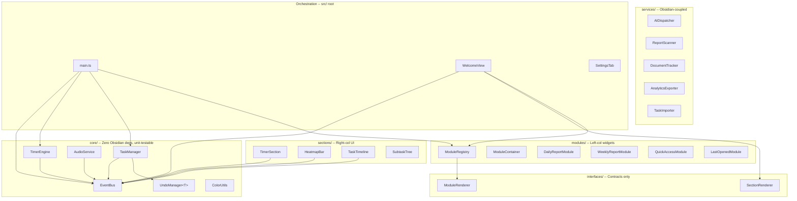

# Architecture

## System Overview

Vault Welcome is an Obsidian plugin that replaces the default empty tab with a productivity dashboard. The architecture is organized around three core principles: **single responsibility** (each class owns one idea), **composition over inheritance** (small, stackable systems), and **decoupled communication** (event bus over hard references).

## Layer Diagram



## Data Flow

Timer state, task mutations, and UI updates propagate through the EventBus:

```
Command (main.ts)
    |
    v
EventBus.emit("task:start", { task })
    |
    +---> TimerSection.handleStartTask()  --> TimerEngine.start()
    |                                             |
    |                                             v
    |                                     EventBus.emit("timer:tick")
    |                                     EventBus.emit("timer:state-change")
    |                                             |
    |                                             +---> main.ts: scheduleSave()
    |                                             +---> WelcomeView: updateTimerDisplay()
    |
    +---> (future listeners can react without coupling)
```

Task mutations follow a similar path:

```
TaskManager.addTask()
    |
    v
UndoManager.push(snapshot)
    |
    v
EventBus.emit("task:changed")
    |
    +---> main.ts: persist to data.json
    +---> WelcomeView: re-render
```

## Design Decisions

### Event Bus over Direct Callbacks

**Before**: `main.ts` reached through `WelcomeView -> getTimerSection() -> handleStartTask()` to start tasks from commands. TaskTimeline imported TimerSection directly to call its methods.

**After**: Commands emit events on the bus. TimerSection subscribes to `task:start` and `task:skip`. No command needs a reference to any view or section.

**Why**: Decoupled communication. Adding a new listener (logging, analytics, notifications) requires zero changes to existing code. Sections don't know about each other.

### Generic Undo

`UndoManager<T>` accepts any snapshot type. TaskManager uses `UndoManager<{ tasks, archivedTasks }>`. Future systems (module layout, settings) can use their own typed undo stacks without duplicating the core logic.

### SectionRenderer / ModuleRenderer Split

The dashboard has two distinct composition systems:
- **Sections** (right column): timer, heatmap, task timeline. Rendered by zone + order. Implement `SectionRenderer`.
- **Modules** (left column): report widgets, document panels, quick access. Rendered in a card grid with drag-reorder. Implement `ModuleRenderer`.

Splitting the interfaces prevents coupling between the two systems and makes each independently extensible.

### Core Has Zero Platform Dependencies

Everything in `core/` imports only from `core/` or standard browser APIs. No Obsidian imports. This means:
- Core logic is testable with plain Node (no mocking the Obsidian API)
- The engine layer can be reused in a different host (VS Code extension, web app)
- Build failures in core/ are always logic bugs, never platform API changes

### Data-Driven Report Sources

Report sources were hardcoded in `buildReportSources()`. Now they live in `PluginSettings.reportSources` as `ReportSourceConfig[]` with user-configurable folder, pattern, frequency, and enabled/disabled state. The SettingsTab provides UI for toggling and adding sources.

## Extension Points

### Custom Sections

Implement `SectionRenderer` and register in `buildSections()`:

```typescript
export interface SectionRenderer {
  readonly id: string;
  readonly zone: 'top-bar' | 'right-col' | 'left-col';
  readonly order: number;
  render(parent: HTMLElement): void;
  update?(): void;
  destroy?(): void;
}
```

### Custom Modules

Implement `ModuleRenderer` and call `plugin.registerModule(renderer)`:

```typescript
export interface ModuleRenderer {
  readonly id: string;
  readonly name: string;
  readonly showRefresh?: boolean;
  renderContent(el: HTMLElement): void;
  renderHeaderActions?(actionsEl: HTMLElement): void;
  destroy?(): void;
}
```

### Event Bus Subscriptions

External plugins can subscribe to events for cross-plugin integration:

```typescript
const bus = plugin.eventBus;
bus.on('task:complete', (payload) => { /* react */ });
bus.on('timer:tick', (payload) => { /* react */ });
```

## AI Integration Architecture

`AIDispatcher` assembles context from the task (title, description, subtasks, linked documents, images) into a markdown prompt file. It then invokes the configured CLI tool (Cursor or Claude Code) with the prompt path. The dispatcher is stateless -- it reads task data, writes a temp file, and shells out. All AI features are independently toggleable.

## Core vs Obsidian Boundary

| Layer | Obsidian Imports | Testable Without Mocks |
|-------|-----------------|----------------------|
| `core/` | None | Yes |
| `interfaces/` | None | Yes |
| `sections/` | `App`, `setIcon` | Needs Obsidian stubs |
| `modules/` | `App`, `setIcon` | Needs Obsidian stubs |
| `services/` | `App`, `TFile`, `Notice` | Needs Obsidian stubs |
| `modals/` | `Modal`, `App` | Needs Obsidian stubs |
| `ui/` | None / minimal | Mostly yes |
| Root | `Plugin`, `ItemView` | Needs Obsidian stubs |
